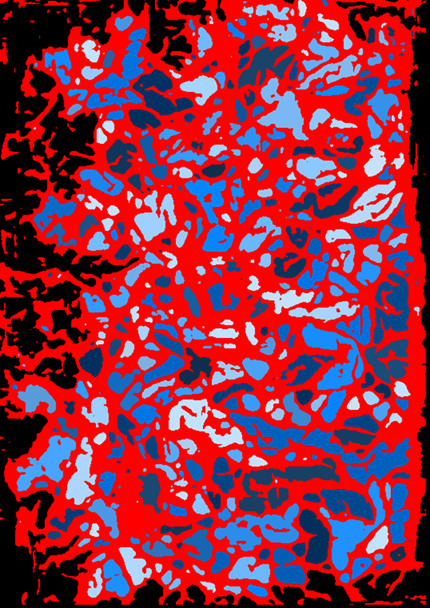

# Vascular Metrics Reference (`global_metrics_df`)

## Scope and Definitions

All values are sample-level metrics derived from the final cleaned segmentation/skeleton/graph.

Symbols used below:
- $V_{chip}$: chip volume ($\mu m^3$)
- $V_{vessel}$: segmented vessel volume ($\mu m^3$)
- $L_{total}$: total centerline length of all graph edges ($\mu m$)
- $N_{junction}$: number of non-sprout graph nodes
- $N_{sprout}$: number of graph edges touching at least one sprout node

Default voxel size is `(2, 2, 2) µm`.

## Distance Convention (important)

The notebook currently sets `junction_distance_mode = 'skeleton'`.

- `skeleton`: nearest-neighbor distances are graph shortest-path lengths along vessel centerlines (biologically traversable route).
- `euclidean`: nearest-neighbor distances are straight-line distances in physical space.

Use one mode consistently across a study.

## Complete Output Parameter Dictionary

| Column | Units | Mathematical meaning | Biological interpretation |
|---|---:|---|---|
| `chip_volume_um3` | $\mu m^3$ | $V_{chip}$ | Physical assay/imaged volume used for normalization. |
| `vessel_volume_um3` | $\mu m^3$ | $V_{vessel}$ from vessel-positive voxels | Total vascular biomass/occupancy in the sample. |
| `vessel_volume_fraction` | unitless | $V_{vessel}/V_{chip}$ | Fraction of chip occupied by vessels. |
| `total_vessel_length_um` | $\mu m$ | $L_{total}$ from summed edge polyline lengths | Total vascular extent/coverage by centerline length. |
| `vessel_length_per_chip_volume_um_inverse2` | $\mu m^{-2}$ | $L_{total}/V_{chip}$ | 3D vessel packing density (length density). |
| `sprouts_per_vessel_length_um_inverse` | $\mu m^{-1}$ | $N_{sprout}/L_{total}$ | Sprouting intensity relative to network size. |
| `junctions_per_vessel_length_um_inverse` | $\mu m^{-1}$ | $N_{junction}/L_{total}$ | Branching intensity per unit vessel length. |
| `skeleton_fractal_dimension` | unitless | Box-counting slope of the cleaned graph-derived skeleton mask | Geometric/topological complexity of vessel branching architecture (largely independent of caliber). |
| `skeleton_lacunarity` | unitless | Gap/heterogeneity statistic from box-mass distribution on the cleaned graph-derived skeleton mask | Patchiness/uneven spatial clustering of the vascular centerline network. |
| `median_sprout_and_branch_tortuosity` | unitless | Median of per-edge $\tau = L_{path}/L_{endpoints}$ (clipped to [0,5]) | Typical vessel winding vs straightness. |
| `p90_minus_p10_sprout_and_branch_tortuosity` | unitless | $P90(\tau)-P10(\tau)$ | Heterogeneity of vessel tortuosity. |
| `median_sprout_and_branch_median_cs_area_um2` | $\mu m^2$ | Median of per-edge median sampled cross-sectional area values | Typical vessel caliber (thickness proxy). |
| `p90_minus_p10_sprout_and_branch_median_cs_area_um2` | $\mu m^2$ | Spread $P90-P10$ of per-edge median cross-sectional area | Heterogeneity of vessel caliber. |
| `median_junction_dist_nearest_junction_um` | $\mu m$ | Median nearest-neighbor junction distance | Typical branchpoint spacing. |
| `p90_minus_p10_junction_dist_nearest_junction_um` | $\mu m$ | Spread $P90-P10$ of nearest junction distances | Heterogeneity of branchpoint spacing. |
| `median_sprout_dist_nearest_endpoint_um` | $\mu m$ | Median nearest-neighbor sprout-endpoint distance | Typical tip-to-tip spacing (terminal clustering). |
| `p90_minus_p10_sprout_dist_nearest_endpoint_um` | $\mu m$ | Spread $P90-P10$ of nearest sprout distances | Heterogeneity of endpoint spacing. |
| `total_internal_pore_count` | count | Number of valid internal pores across slices | Total enclosed void events in vascular area. |
| `internal_pore_area_fraction_in_filled_vascular_area` | unitless | Total valid pore area / total hole-filled vascular area | Fraction of vascular area that is porous/voided. |
| `median_internal_pore_area_um2` | $\mu m^2$ | Median valid pore area | Typical pore size by area. |
| `p90_minus_p10_internal_pore_area_um2` | $\mu m^2$ | Spread $P90-P10$ of pore area | Heterogeneity of pore area. |
| `median_internal_pore_max_inscribed_radius_um` | $\mu m$ | Median pore max-inscribed radius | Typical intrinsic pore radius scale. |
| `p90_minus_p10_internal_pore_max_inscribed_radius_um` | $\mu m$ | Spread $P90-P10$ of max-inscribed radius | Heterogeneity of pore radius scale. |
| `sprouts_per_chip_volume_um_inverse3` | $\mu m^{-3}$ | $N_{sprout}/V_{chip}$ | Sprout density per chip volume. |
| `junctions_per_chip_volume_um_inverse3` | $\mu m^{-3}$ | $N_{junction}/V_{chip}$ | Junction density per chip volume. |
| `total_internal_pore_density_per_vessel_volume_um_inverse3` | $\mu m^{-3}$ | `total_internal_pore_count / V_{vessel}` | Pore-event burden relative to vascular biomass. |

## Mathematical Explanations/Caveats
- **Fractal Dimension:** computed from the cleaned graph-derived skeleton mask. It spans from line-like (1d) to area-like (2d) behavior; in this 3D workflow treat it as a scale-dependent complexity index (higher usually means more branching complexity/space filling of centerlines).
  
	- *Note:* this is skeleton-based, so it emphasizes network architecture rather than vessel thickness.

- **Lacunarity:** computed on the cleaned graph-derived skeleton mask (not the full segmentation mask). Lower values indicate a more evenly distributed centerline network; higher values indicate stronger clustering/patchiness of branches across space.
	- *Isn't that measuring the same thing as the spread in vessel/hole cross sectional area?* Not quite. Caliber and pore spread are size-distribution metrics; skeleton lacunarity is a spatial-organization metric. You can match one and change the other.

## Pore Inclusion/Exclusion Rules

Pores are detected slice-wise! Tracking pores across 3d slices is possible, but slow, so there is a tradeoff. There is a maximum area cutoff (`max_pore_area_fraction_of_slice`), which by default is 0.1 (10% of slice area), which removes empty areas outside the vasculature. Tiny holes (`min_pore_area_um2`, less than 16um^2 as default) are removed from downstream analysis. This suppresses tiny noise and very large likely-artifactual cavities.

