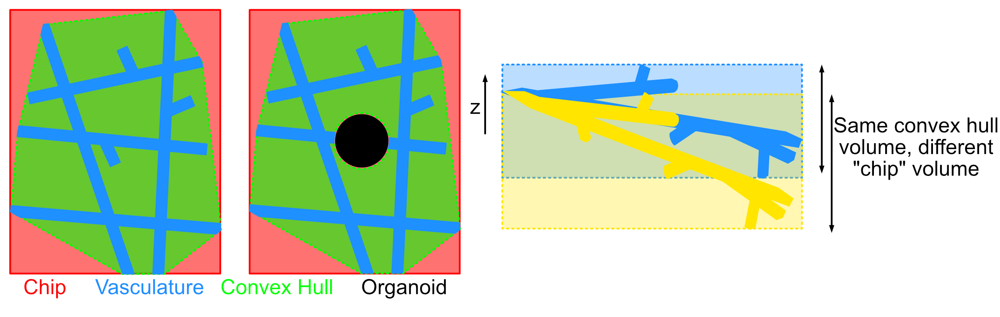
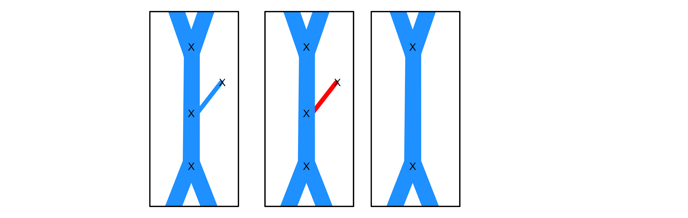
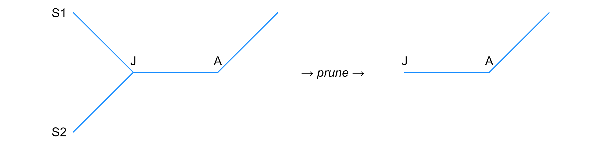

# VascuMap Analysis Outputs — Reference and Biological Interpretation

VascuMap outputs three CSV files for each image processed:

| File | Row granularity | Number of columns | Intended use |
|---|---|---|---|
| `{name_prefix}_analysis_metrics.csv` | One row per image | ID columns + **18 curated features** | The recommended panel for use in the lab. This CSV contains a subset of biologically interpretable, shape-invariant descriptors. |
| `{name_prefix}_all_morphological_params.csv` | One row per image | ID columns + **all** computed morphological metrics (~210) | Contains every global metric the pipeline computes, including disaggregated `mean` / `std` / `median` / `spread` (the P90−P10 difference) statistics split four ways (branch / attached_sprout / floating_sprout / sprout_and_branch) and per-junction-type connectivity stats (including a sprout-free `branch_only_junction` family). Useful to have on file for future analyses, or useful for future GNN embedding. |
| `{name_prefix}_branch_metrics.csv` | One row per skeleton **edge** (vessel segment) | 26 columns including `node_start`/`node_end` integer IDs and an `edge_kind` string | The **graph table**: each row is one branch/sprout in the cleaned vessel graph, with its `edge_kind` (`branch`, `attached_sprout`, or `floating_sprout`), endpoint coordinates, length, calibre, tortuosity and orientation. Suitable as edge features for a future **graph neural network embedding**, or for plotting per-branch distributions. Probably not useful for individual lab users! |

The first three columns of every CSV are identical and identify the image:
`image_name`, `source_file`, `image_index`.

The curated `analysis_metrics.csv` is just a subset of
`all_morphological_params.csv`, curated for easier plotting/readability
in the lab.

---

## Why We Picked these Parameters

All values are derived from the **cleaned segmentation** (after smoothing, hole-filling, and pruning).
The resulting graph networks have mid-node removal and border-zone trimming.
Analysis parameters have been selected based on:
1. **Shape-invariance.** This means that they don't scale with the chip size.
   They are either dimensionless ratios (e.g. vessel volume fraction),
   per-unit-volume densities normalised by the convex hull (every
   `*_per_volume` column), or intrinsic per-vessel/per-junction
   quantities (e.g. typical branch length in microns). We don't want to measure
   values like "vessel volume", as this will trivially increase with increasing
   chip size. The analysis parameters selected prevent PCAs from just separating
   different chip sizes: images of the same biology but cropped to different
   sizes should give very similar output values.
3. **Biological interpretability.** Biologically relevant features have been
   selected.
5. **Manageable dimensionality.** Seventeen features is hopefully
   sufficient to allow PCA clustering at smaller sample sizes while still
   carrying separable density, geometry, topology, connectivity, and
   orientation channels.

Lots of parameters are divided by a volume to ensure shape invariance. We have
chosen the convex hull volume ($V_{hull}$) as the denominator for this normalisation.
The convex hull volume is usually just ~ the chip (gel) volume. However, in cases where
the vasculature is tilted, there can be some differences between the convex hull and chip 
volume, so we use the convex hull volume to be safe. In cases where there is an organoid in
the gel, the organoid region is subtracted from the convex hull volume before normalisation. 

  

## Sprout classification

Every edge of the cleaned graph is classified into one of three
`edge_kind` categories:

| `edge_kind` | Definition | Biological interpretation |
|---|---|---|
| `branch` | An edge in the **sprout-collapsed graph** (every sprout-bearing intermediate junction has been dissolved). | Established connecting vasculature. |
| `attached_sprout` | An edge with **exactly one** degree-1 endpoint, where the other endpoint is part of a connected component that contains at least one junction. | Active angiogenesis — a new tip extending from a parent vessel. |
| `floating_sprout` | An edge in a connected component of **exactly two nodes**, both degree-1. | Vessel retraction or detachment, or segmentation noise — a fragment no longer connected to the network. |

The split between attached and floating sprouts is reported separately
so the curated panel carries a dedicated angiogenesis proxy
(`attached_sprouts_per_volume`) and a dedicated retraction / noise
proxy (`floating_sprouts_per_volume`). `branch_metrics.csv` stores the
classification verbatim in its `edge_kind` column.

  

Branch-side geometry features (`median_branch_length`, `median_branch_median_cs_area`, `median_branch_tortuosity`, …) are computed on the sprout-collapsed graph so a vessel `A — J — B` carrying a sprout off `J` contributes one branch, not two. The full audit file additionally exposes attached-sprout-only and floating-sprout-only aggregates for every per-edge metric (length, calibre, tortuosity, orientation, …), but those are excluded from the curated panel because their absolute values are dominated by the skeletonisation algorithm.

  

Symbols used throughout:

- $V_{hull}$: convex-hull volume of the segmented vasculature in $\mu m^3$.
  When an organoid is masked, the volume of the organoid in the convex hull
  is subtracted from the hull volume. In symbols:
  $V_{hull} = V_{hull,\,raw} - V_{organoid \cap hull}$.
- $V_{vessel}$: total vessel volume (number of vessel-positive voxels times
  voxel volume) in $\mu m^3$. The organoid region is set to zero in the
  segmentation before this is counted, so excluded voxels never contribute.
- $L_{total}$: total centerline length of branches in $\mu m$, summed over
  the **sprout-collapsed graph** (sprout edges are excluded because their
  length depends on tip-pruning depth).
- $N_{junction}$: number of non-sprout graph nodes (i.e. branch points)
  in the cleaned graph.
- $N_{branch}$: number of edges in the sprout-collapsed graph.
- $N_{attached\_sprout}$: number of edges classified as
  `attached_sprout` (one degree-1 endpoint, attached to a junction-containing component).
- $N_{floating\_sprout}$: number of edges classified as
  `floating_sprout` (a 2-node component with both nodes degree-1).
  Equivalent to the number of such components.
- "$P90 - P10$" denotes the spread between the 90th and 10th percentiles of a
  distribution. Selected as a robust, outlier-tolerant measure of the spread of values.
- "Sprout" = a degree-1 endpoint (a tip). "Attached sprout" = a sprout
  edge whose component still contains a junction. "Floating sprout"
  = an edge in a 2-node, both-degree-1 component (a detached fragment).
  "Branch" = a non-sprout edge in the sprout-collapsed graph.
  "Sprout-and-branch" = the union (every edge in the cleaned graph).

## Curated Analysis Metrics

There are 18 features in `*_analysis_metrics.csv`. 

#### Density (5 features)

| Column | Units | Math | Biological meaning | Why it is shape-invariant |
|---|---|---|---|---|
| `vessel_volume_fraction` | unitless | $V_{vessel}/V_{hull}$ | The fraction of the convex hull around the vasculature that is actually filled with vessel tissue. A global readout of how densely vascularised the sample is, regardless of how big the imaged region was. **Excluded organoid volume is subtracted from the denominator** so the fraction reflects only the gel space available for vessels. | Ratio of two volumes, both intrinsic to the sample. |
| `branch_length_per_volume` | $\mu m^{-2}$ | $L_{total}/V_{hull}$ | Total amount of **non-sprout** vessel "wire" per unit envelope volume. Sprouts are excluded from the numerator because their length depends on tip-pruning depth. Higher means more or finer connecting vasculature. | Length divided by volume → intensive (does not scale with FOV). |
| `attached_sprouts_per_volume` | $\mu m^{-3}$ | $N_{attached\_sprout}/V_{hull}$ | Density of **attached** sprout tips per unit hull volume — a direct readout of **angiogenic sprouting intensity**. Floating-sprout fragments are excluded so the metric is not contaminated by detached pieces or segmentation noise. | Count per volume. |
| `junctions_per_volume` | $\mu m^{-3}$ | $N_{junction}/V_{hull}$ | Junction count per unit hull volume — the spatial density of branch points within the gel space. A direct readout of **branching intensity**. | Count per volume. |
| `branches_per_volume` | $\mu m^{-3}$ | $N_{branch}/V_{hull}$ | Non-sprout edge count per unit hull volume, taken from the **branch-only graph** (sprout-bearing intermediate junctions dissolved). Together with `junctions_per_volume`, parameterises mesh fineness in two complementary ways (count of vertices vs count of edges). | Count per volume. |

#### Topology (2 features)

| Column | Units | Math | Biological meaning | Why it is shape-invariant |
|---|---|---|---|---|
| `skeleton_fractal_dimension` | unitless | Box-counting slope $D$ of the cleaned skeleton mask (see *Mathematical caveats* below) | A scale-free complexity index of the centerline network. Higher values ($D \to 2$) mean the network fills space more densely with branches; lower values ($D \to 1$) mean it looks more like a sparse tree. | Defined as a scaling exponent, intrinsically scale-free. |
| `skeleton_lacunarity` | unitless | Variance-to-mean statistic of box-mass distribution on the skeleton | A measure of "patchiness" or unevenness in how branches are distributed in space. Low values mean the network is evenly spread; high values mean there are dense clumps separated by empty regions. Two networks can share fractal dimension but differ strongly in lacunarity. | Constructed from a normalised mass distribution. |

#### Branch geometry (4 features)

These describe the geometry of the graph after sprout removal.

| Column | Units | Math | Biological meaning | Why it is shape-invariant |
|---|---|---|---|---|
| `median_branch_length` | $\mu m$ | Median of per-edge centerline lengths $L_{path}$ across non-sprout edges | The **typical length of a connecting vessel segment** between two branch points. Larger values = longer, less subdivided vessels; smaller values = a finely subdivided, mesh-like network. | An intrinsic length of one structural unit. |
| `spread_branch_length` | $\mu m$ | $P90(L_{path}) - P10(L_{path})$ across non-sprout edges | How heterogeneous the connecting-segment lengths are. A small spread means a uniform mesh; a large spread means the sample has a mixture of short capillary segments and long arterial-like runs. | Difference of two percentiles of an intrinsic length. |
| `median_branch_median_cs_area` | $\mu m^2$ | Median across non-sprout edges of each edge's median sampled cross-sectional area | The **typical vessel calibre** (cross-section area) — a thickness proxy — for established (non-tip) vasculature. | Per-vessel measurement, independent of how many vessels are imaged. |
| `spread_branch_median_cs_area` | $\mu m^2$ | $P90 - P10$ of the per-edge median cross-section area across non-sprout edges | Heterogeneity of vessel calibre across the connecting network. Large spread = mixed vessel sizes; small spread = uniformly sized vessels. | Spread of an intrinsic per-vessel quantity. |

#### Tortuosity — branch-only (2 features)

| Column | Units | Math | Biological meaning | Why it is shape-invariant |
|---|---|---|---|---|
| `median_branch_tortuosity` | unitless | Median of $\tau = L_{path}/L_{endpoints}$ across non-sprout edges; $\tau$ clipped to $[1, 50]$ | The **typical curviness of a vessel**. $\tau = 1$ means perfectly straight; $\tau > 1$ means winding. | Ratio of two lengths; dimensionless. |
| `spread_branch_tortuosity` | unitless | $P90(\tau) - P10(\tau)$ across non-sprout edges | How heterogeneous the curviness is across branches — a small spread means uniformly straight (or uniformly winding) vessels, a large spread means a mix of straight and tortuous vessels coexist. We use a percentile spread rather than the standard deviation here so that the small number of clipped-at-50 outliers (see *Tortuosity clipping*, below) cannot dominate the statistic. | Difference of two percentiles of a dimensionless quantity. |

#### Junction connectivity (2 features)

| Column | Units | Math | Biological meaning | Why it is shape-invariant |
|---|---|---|---|---|
| `median_branch_only_junction_degree` | unitless | Median graph degree of nodes in the **sprout-collapsed graph** (sprout edges and floating fragments removed entirely). | The **typical branching factor** at a junction once sprouts are ignored. A value near 3 means most branch points are simple Y-junctions (the canonical vascular branching pattern); higher values indicate more complex multi-way meeting points. Computing on the sprout-collapsed graph means a Y-junction with a tip dangling off it still counts as degree 3, not degree 4. | Pure graph-theoretic count; FOV-independent. |
| `spread_branch_only_junction_degree` | unitless | $P90 - P10$ of branch-only junction degree | How variable the branching pattern is across the network. A homogeneous capillary bed will have very small spread; a network with frequent multi-way "hubs" will have larger spread. Using $P90 - P10$ rather than std is consistent with the other spread metrics and avoids inflation by rare very-high-degree nodes. | Spread of a count; dimensionless. |

#### Orientation (2 features)

Orientation is measured relative to the device long axis. The pipeline
infers the long axis automatically from the image footprint: if the image
is wider than it is tall ($x$-extent $\ge$ $y$-extent) it uses the $x$
axis; otherwise it uses the $y$ axis. This means rotated acquisitions are
handled correctly without any manual configuration. The angle reported is
the acute angle in the $xy$ plane between each branch's end-to-end
direction and that auto-detected long axis, expressed in degrees in
$[0, 90]$.

| Column | Units | Math | Biological meaning | Why it is shape-invariant |
|---|---|---|---|---|
| `median_sprout_and_branch_orientation` | degrees in $[0, 90]$ | Median branch orientation | The **dominant alignment** of vessels with respect to the device. A value near $45°$ means no preferred direction (isotropic); values near $0°$ or $90°$ indicate strong alignment with or perpendicular to the device axis (e.g. flow-induced alignment in a perfused chamber). | Per-branch angle; geometry independent of FOV size. |
| `spread_sprout_and_branch_orientation` | degrees | $P90 - P10$ of branch orientation | Network **anisotropy**: how concentrated the orientations are around their median. A small spread means almost all vessels point in the same direction; a large spread (towards $80°$) means orientations are nearly uniform. | Spread of an angle. |

#### Floating sprouts (1 feature)

| Column | Units | Math | Biological meaning | Why it is shape-invariant |
|---|---|---|---|---|
| `floating_sprouts_per_volume` | $\mu m^{-3}$ | $N_{floating\_sprout}/V_{hull}$ | Density of fully-detached vessel fragments (2-node, both-degree-1 components) per unit hull volume. Interpret as a proxy for **vessel retraction or detachment**, with the caveat that high values can also indicate noisy segmentation. Reported alongside `attached_sprouts_per_volume` so the angiogenesis-vs-retraction balance is visible at a glance. | Count per volume. |

Nearest-neighbour spacing metrics (`*_dist_nearest_*`) are not part of the
curated panel — they remain available in the full
`*_all_morphological_params.csv` (both along-skeleton and Euclidean
variants).

---

## Per-branch metrics — the GNN-ready table

`*_branch_metrics.csv` has **one row per edge** in the cleaned vessel graph.
Together with the integer node IDs (`node_start`, `node_end`) it forms a
ready-made edge list for a graph neural network: each row carries the
geometric features of one vessel segment, and the IDs let you reconstruct
the graph topology.

| Column | Units | Meaning |
|---|---|---|
| `node_start`, `node_end` | int | Integer IDs of the two graph nodes this edge connects. Use these to build the GNN edge index. |
| `edge_kind` | string | One of `branch` (both endpoints are junctions), `attached_sprout` (exactly one endpoint is a degree-1 tip; the other is a junction in the wider graph) or `floating_sprout` (the edge sits in an isolated 2-node component where both endpoints are degree 1). Used by the aggregator family to split per-edge geometry into the four subsets `branch`, `attached_sprout`, `floating_sprout`, and `sprout_and_branch`. |
| `start_z_idx`, `start_y_idx`, `start_x_idx`, `end_z_idx`, `end_y_idx`, `end_x_idx` | voxels | Endpoint coordinates in voxel index space. |
| `start_z`, `start_y`, `start_x`, `end_z`, `end_y`, `end_x` | $\mu m$ | The same endpoints in physical units (voxel index times voxel size). |
| `path_length` | $\mu m$ | The **curved length** of the vessel segment, summed along its centerline polyline. This is the biologically relevant distance "along the pipe". |
| `endpoint_distance` | $\mu m$ | The **straight-line distance** between the two endpoints. Compare with `path_length` to assess curvature. |
| `tortuosity` | unitless | $\tau = L_{path}/L_{endpoints}$, clipped to $[1, 50]$. A direct curviness score: $\tau = 1$ is perfectly straight, $\tau \gg 1$ is very winding. |
| `mean_cs_area`, `median_cs_area`, `std_cs_area` | $\mu m^2$ | Cross-sectional area sampled along the segment from the local distance transform; mean / median / standard deviation of those samples. The median is more robust to local segmentation noise. |
| `mean_width`, `median_width` | $\mu m$ | Equivalent circular widths $w = \sqrt{4 A / \pi}$ derived from the corresponding cross-section area. Interpret as the diameter of a circle with the same area as the local vessel cross-section. |
| `branch_volume` | $\mu m^3$ | Approximate volume of the vessel segment, computed as `mean_cs_area × path_length`. |
| `orientation_to_device_axis` | degrees in $[0, 90]$ | Acute angle between the segment's endpoint-to-endpoint vector (in the $xy$ plane) and the device long axis. |

---

## All Morphological Parameters — full audit reference
Voxel-index variants of per-edge endpoint coordinates carry an `_idx`
suffix (e.g. `start_z_idx`) to distinguish them from the physical-µm
versions (e.g. `start_z`). Aggregator column names follow
`<aggregate>_<subset>_<column>`, where `<aggregate>` is one of `mean`,
`std`, `median`, or `spread` (the P90 − P10 difference, an
outlier-robust measure of distribution width).
`*_all_morphological_params.csv` contains a superset of every metric
the pipeline computes. It includes:

1. **All of the curated 18 features above** (so you never need to re-run the
   pipeline to switch between curated and full views).
2. **All of the per-image global metrics** that the pipeline computes
   internally — see the table below.
3. **Disaggregated branch statistics**: for each of the per-branch metrics
   `volume`, `length`, `endpoint_distance`, `tortuosity`,
   `mean_cs_area`, `median_cs_area`, `std_cs_area`,
   `mean_width`, `median_width`, `orientation`, the file contains
   `mean_*`, `std_*`, `median_*`, and `spread_*` aggregated over four
   edge subsets, selected via the per-edge `edge_kind` column:
   (a) **`branch`** edges (`*_branch_*`),
   (b) **`attached_sprout`** edges (`*_attached_sprout_*`),
   (c) **`floating_sprout`** edges (`*_floating_sprout_*`), and
   (d) **all edges combined** (`*_sprout_and_branch_*`).
   For example: `mean_branch_length`,
   `std_attached_sprout_tortuosity`,
   `median_floating_sprout_mean_width`,
   `spread_sprout_and_branch_length`. The `spread_*` family is an
   outlier-robust measure of spread (the difference between the 90th and
   10th percentile) and is preferred over `std_*` whenever the underlying
   distribution has heavy tails or hard-clipped values.
4. **Disaggregated junction statistics**: for each of the per-junction metrics
   `degree`, `dist_nearest_junction`, `dist_nearest_endpoint`,
   `num_junction_neighbors`, `num_endpoint_neighbors`, the file contains
   `mean_*`, `std_*`, `median_*`, and `spread_*` aggregated over four
   node subsets:
   (a) **junction nodes** in the cleaned graph (`*_junction_*`),
   (b) **sprout-tip nodes** (`*_sprout_tip_*`),
   (c) **all nodes combined** (`*_all_nodes_*`), and
   (d) **junction nodes in the sprout-collapsed branch-only graph**
   (`*_branch_only_junction_*`) — same node set as (a) but with sprouts
   removed and intermediate sprout-bearing junctions dissolved, so the
   degree distribution reflects the canonical Y-junction interpretation.
   For example: `mean_junction_degree`,
   `std_sprout_tip_dist_nearest_endpoint`,
   `spread_all_nodes_degree`, `median_branch_only_junction_degree`.

### Headline global-metric dictionary

The columns below are emitted directly by the pipeline (they are the
"global" entries on top of which the disaggregated stats are layered):

| Column | Units | Mathematical meaning | Biological interpretation |
|---|---:|---|---|
| `chip_volume` | $\mu m^3$ | $V_{chip}$, the imaged chip volume (minus any excluded organoid region). | Physical assay/imaged volume used internally for normalisation. **Excluded from curated panel** because it depends on FOV. |
| `convex_hull_volume` | $\mu m^3$ | $V_{hull}$, volume of the 3D convex hull of vessel-positive voxels. | The "envelope" the vasculature occupies. **Excluded from curated panel** for the same reason. |
| `vessel_volume` | $\mu m^3$ | $V_{vessel}$, total vessel-positive volume. | Total vascular biomass. **Excluded from curated panel.** |
| `vessel_volume_fraction` | unitless | $V_{vessel}/V_{hull}$ | **Curated.** Fraction of hull occupied by vessels. |
| `total_vessel_length` | $\mu m$ | $L_{total}$, sum of polyline lengths over the **branch-only graph** (sprout-bearing intermediate junctions dissolved; sprouts excluded — their length depends on tip-pruning depth). | Total length of established (non-tip) vasculature. **Excluded from curated panel** (size-dependent); used internally as the numerator of `branch_length_per_volume`. |
| `branch_length_per_volume` | $\mu m^{-2}$ | $L_{total}/V_{hull}$ | **Curated.** 3D length density of non-sprout vasculature. |
| `attached_sprouts_per_vessel_length` | $\mu m^{-1}$ | $N_{attached\_sprout}/L_{total}$ | Attached-sprout count per unit vessel length. **Excluded from curated panel** as largely captured by `attached_sprouts_per_volume`. |
| `junctions_per_vessel_length` | $\mu m^{-1}$ | $N_{junction}/L_{total}$ | Branching intensity per unit vessel length. **Excluded from curated panel** as largely captured by the `*_per_volume` densities. |
| `attached_sprouts_per_volume` | $\mu m^{-3}$ | $N_{attached\_sprout}/V_{hull}$ | **Curated.** Density of attached (degree-1) sprout tips per unit envelope volume — the angiogenic-sprouting headline. |
| `floating_sprouts_per_volume` | $\mu m^{-3}$ | $N_{floating\_sprout}/V_{hull}$ | **Curated.** Density of fully-detached 2-node sprout components per unit envelope volume — the retraction / detachment proxy reported alongside `attached_sprouts_per_volume`. |
| `junctions_per_volume` | $\mu m^{-3}$ | $N_{junction}/V_{hull}$ | **Curated.** Junction density per unit envelope volume. |
| `branches_per_volume` | $\mu m^{-3}$ | $N_{branch}/V_{hull}$ | **Curated.** Non-sprout edge density per unit envelope volume, counted on the **branch-only graph** (sprout-bearing intermediate junctions dissolved). |
| `skeleton_fractal_dimension` | unitless | Box-counting slope of the cleaned graph-derived skeleton mask. | **Curated.** Geometric complexity of the centerline network. |
| `skeleton_lacunarity` | unitless | Gap/heterogeneity statistic on the same skeleton mask. | **Curated.** Spatial patchiness / unevenness of the centerline network. |
| `median_sprout_and_branch_orientation` | degrees | Median per-edge orientation to the auto-detected device long axis (over **all** edges, sprouts included). | **Curated.** Dominant vessel alignment. |
| `spread_sprout_and_branch_orientation` | degrees | Spread $P90 - P10$ of per-edge orientation over all edges. | **Curated.** Anisotropy of vessel alignment. |
| `median_branch_only_junction_degree` | unitless | Median node degree taken over **junction nodes of the sprout-collapsed branch-only graph** (sprouts removed, intermediate sprout-bearing junctions dissolved). | **Curated.** Canonical Y-junction connectivity — a value near $3$ indicates classical bifurcating vasculature, higher values indicate denser meshing. |
| `spread_branch_only_junction_degree` | unitless | Spread $P90 - P10$ of branch-only junction degree. | **Curated.** Heterogeneity of canonical junction connectivity. |
| `median_junction_skeleton_dist_nearest_junction` | $\mu m$ | Median over branch points of the shortest along-skeleton distance to the nearest other branch point (whole-network headline metric). | Characteristic mesh size. *(Per-junction Euclidean equivalents are emitted by the disaggregated stats as `median_junction_dist_nearest_junction` etc.)* |
| `spread_junction_skeleton_dist_nearest_junction` | $\mu m$ | Spread of along-skeleton nearest-junction distances. | Heterogeneity of branch-point spacing. |
| `median_sprout_tip_skeleton_dist_nearest_endpoint` | $\mu m$ | Median along-skeleton nearest-endpoint distance among sprout tips. | Typical tip-to-tip spacing. |
| `spread_sprout_tip_skeleton_dist_nearest_endpoint` | $\mu m$ | Spread of along-skeleton nearest-endpoint distances. | Heterogeneity of tip-to-tip spacing. |
| `average_vessel_volume` | $\mu m^3$ | Mean of `branch_volume` over all edges. | Typical per-segment vessel volume. **Excluded from curated panel** because it is largely a product of typical length and typical calibre, both already kept. |
| `n_attached_sprouts` | count | $N_{attached\_sprout}$ — number of attached-sprout edges (one degree-1 endpoint, one junction endpoint). | Raw attached-sprout count. **Excluded from curated panel** (FOV-dependent); use `attached_sprouts_per_volume` instead. |
| `n_floating_sprouts` | count | $N_{floating\_sprout}$ — number of floating-sprout components (2-node components with both endpoints degree 1). | Raw floating-sprout count. **Excluded.** |
| `total_number_of_branches` | count | Number of edges in the **branch-only graph** (cleaned graph with every sprout node removed and degree-2 mid-nodes collapsed). A vessel ``A — J — B`` with a tip off ``J`` is counted as one branch, not two. | Raw branch count. **Excluded.** |
| `total_number_of_junctions` | count | $N_{junction}$. | Raw junction count. **Excluded.** |
| `total_number_of_edges` | count | Total number of edges in the cleaned graph. | Raw edge count. **Excluded.** |
| `total_number_of_nodes` | count | Total number of nodes in the cleaned graph. | Raw node count. **Excluded.** |

The disaggregated `mean_*` / `std_*` / `median_*` / `spread_*` ×
`{branch, attached_sprout, floating_sprout, sprout_and_branch}` ×
geometry-column families (and the corresponding junction-side families
over `{junction, sprout_tip, all_nodes, branch_only_junction}`) follow a
consistent naming pattern, so any column not listed above can be decoded
by reading its name left-to-right. The `<aggregate>` token is one of
`mean`, `std`, `median`, or `spread` (the difference between the 90th and
10th percentile, i.e. an outlier-robust spread measure).

> `<aggregate>_<edge subset>_<per-branch column>` → e.g.
> `std_branch_mean_width` is the *standard deviation* of *non-sprout edge*
> *mean equivalent widths*;
> `median_attached_sprout_length` is the *median* centerline length of
> *attached* sprouts; `spread_sprout_and_branch_length` is the *P90 −
> P10 spread* of *all-edge centerline lengths*.

> `<aggregate>_<node subset>_<per-junction column>` → e.g.
> `mean_sprout_tip_dist_nearest_junction` is the *mean* over *sprout-tip
> nodes* of the *Euclidean distance to the nearest branch-point junction*;
> `median_branch_only_junction_degree` is the *median* degree of junction
> nodes in the *sprout-collapsed branch-only graph*.

---

## Mathematical caveats and visual intuition

### Tortuosity definition and clipping

For every edge in the cleaned graph the pipeline computes

$$\tau = \frac{L_{path}}{L_{endpoints} + \varepsilon}, \qquad \tau \leftarrow \mathrm{clip}(\tau,\, 1,\, 50)$$

where $L_{path}$ is the integrated centerline arc-length, $L_{endpoints}$ is
the straight-line distance between the two endpoints, and $\varepsilon =
10^{-8}\ \mu m$ guards against a literal zero denominator. The clipping
bounds exist for two distinct reasons:

- **Lower bound $\tau \ge 1$.** Geometrically a curve can never be shorter
  than the straight line between its endpoints, so $\tau < 1$ is
  unphysical. In practice $\tau$ can drop slightly below $1$ from
  floating-point round-off when summing many short polyline segments on a
  near-straight branch; clamping at $1$ removes that numerical artefact
  without distorting any real curvature.
- **Upper bound $\tau \le 50$.** When a branch forms a near-closed loop the
  two endpoints can come arbitrarily close in space, so $L_{endpoints} \to
  0$ and $\tau$ explodes. A handful of such degenerate edges would
  otherwise dominate any mean / standard-deviation aggregate and dwarf the
  signal from real winding vessels. Capping at $50$ leaves any biologically
  realistic value untouched (typical vessel tortuosity is in $[1, 3]$,
  pathologically tortuous tumour vessels can reach $\sim 10$) while
  bounding pathological cases. This is also why the curated panel reports
  `spread_branch_tortuosity` rather than the standard deviation:
  percentile-based spread is insensitive to whether a few clipped values
  sit at the cap, whereas $\mathrm{std}$ would be inflated by them.

### Fractal dimension

Computed by box-counting on the cleaned graph-derived skeleton mask. It
spans from line-like (1D) to area-like (2D) behaviour; treat it as a
scale-dependent **complexity index** of the centerline network — higher
generally means more branching and better space-filling. Because it is
computed from the skeleton, it emphasises **architecture rather than vessel
thickness**: two networks of the same shape but different vessel calibres
will have nearly identical fractal dimension.

  

  

### Lacunarity

Computed on the same cleaned skeleton mask. **Lower** values indicate a
**more evenly distributed** centerline network; **higher** values indicate
stronger spatial **clustering / patchiness** of branches.

A common confusion: *"isn't this measuring the same thing as the spread in
vessel cross-sectional area?"* No: skeleton lacunarity is a
**spatial-organisation** metric. 

  

### Distance convention

There are multiple ways to measure "distance to the nearest …". As
illustrated below, the nearest sprout tip to the highlighted branch point
could be one of two options depending on the metric chosen.

  

The pipeline computes **both** modes in every run:

- **`skeleton`**: nearest-neighbour distances are graph shortest-path
  lengths along vessel centerlines — the biologically traversable route.
- **`euclidean`**: nearest-neighbour distances are straight-line
  distances in physical space.

The per-junction Euclidean distances stored in `junction_metrics_df` (and
hence in the disaggregated junction stats) are computed independently and
are always Euclidean. To prevent name collisions, the whole-network
headline distance metrics carry an explicit mode infix in their column
name: `*_skeleton_dist_*` for along-skeleton distances and
`*_euclidean_dist_*` for straight-line distances. The disaggregated
per-junction columns retain the shorter `*_dist_nearest_*` form (always
Euclidean).

### Floating vs. attached sprouts

The pipeline distinguishes two kinds of sprout edge via the per-edge
`edge_kind` column in `*_branch_metrics.csv`:

- **Attached sprout** (`edge_kind == 'attached_sprout'`): an edge with
  exactly one degree-1 endpoint; the other endpoint participates in the
  wider connected vasculature. Interpret as the canonical **angiogenic
  sprout tip**. Counted as `n_attached_sprouts` and reported per volume as
  the curated `attached_sprouts_per_volume`.
- **Floating sprout** (`edge_kind == 'floating_sprout'`): an edge that
  sits inside a 2-node connected component whose **both** endpoints are
  degree 1 — a fully detached vessel fragment. Counted as
  `n_floating_sprouts` and reported per volume as the curated
  `floating_sprouts_per_volume`.

Floating components can represent either real biological detachments
(short isolated capillary fragments) or segmentation noise (a single
voxel-thin bridge missed by the binarisation). Reporting them as a
dedicated curated feature — separate from attached sprouts — lets the
downstream analysis cleanly weigh **angiogenesis** against **retraction
or noise** without the two signals being mixed inside a single
`sprouts_per_volume` number.
