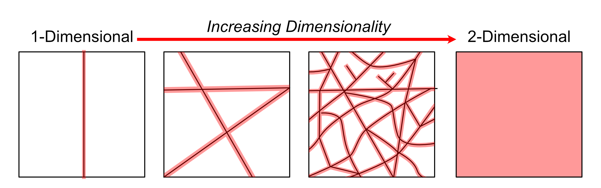
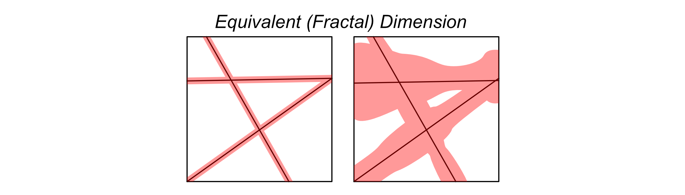
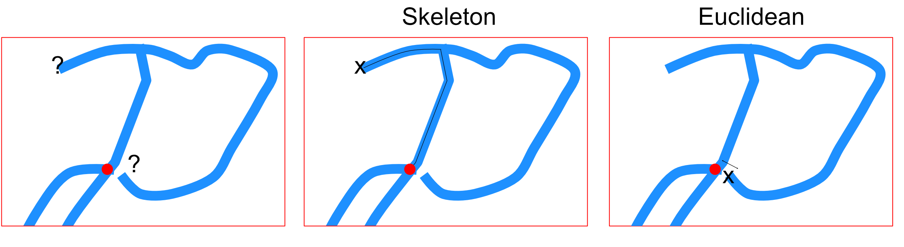

# VascuMap Analysis Outputs — Reference and Biological Interpretation

This document describes the three CSV files produced for every image processed
by the VascuMap pipeline, the meaning of every column they contain, and the
reasoning behind the curated subset of features that we recommend using for
unsupervised clustering and PCA. It is written so that a wet-lab reader (with
no background in image processing or graph theory) can pick up the outputs and
interpret them biologically.

---

## Output CSVs at a glance

For each input image (`{name_prefix}`) the pipeline writes **three** CSV files
into the per-image output folder:

| File | Row granularity | Number of columns | Intended use |
|---|---|---|---|
| `{name_prefix}_analysis_metrics.csv` | One row per image | ID columns + **19 curated features** | The recommended panel for **PCA, UMAP, and unsupervised clustering** across samples. Hand-picked to be biologically interpretable, shape-invariant, and small enough to behave well with modest sample sizes (tens of images). |
| `{name_prefix}_all_morphological_params.csv` | One row per image | ID columns + **all** computed metrics (~120) | The full **audit superset**. Contains every global metric the pipeline computes, including disaggregated mean/std/median statistics split by branch vs sprout vs combined, and per-junction-type connectivity stats. Use when you don't yet know what you'll need, when reviewing the pipeline, or when designing new follow-up analyses. |
| `{name_prefix}_branch_metrics.csv` | One row per skeleton **edge** (vessel segment) | ~25 columns including `node_start`/`node_end` integer IDs | The **graph table**: each row is one branch/sprout in the cleaned vessel graph, with its endpoint coordinates, length, calibre, tortuosity and orientation. Suitable as edge features for a future **graph neural network embedding**, or for plotting per-branch distributions. |

The first three columns of every CSV are identical and identify the image:
`image_name`, `source_file`, `image_index`.

The curated `analysis_metrics.csv` is *always a strict subset* of
`all_morphological_params.csv`, so you can move between the two files without
re-running the pipeline.

---

## Scope and notation

All values are derived from the **final cleaned segmentation, skeleton, and
graph** (after smoothing, hole-filling, pruning, mid-node removal, border /
exclusion zone trimming, and isolated-node removal). The default voxel size
is `(2, 2, 2) µm`.

Symbols used throughout:

- $V_{chip}$: chip / imaged volume in $\mu m^3$.
- $V_{hull}$: convex-hull volume of the segmented vasculature in $\mu m^3$.
- $V_{vessel}$: total vessel volume (number of vessel-positive voxels times
  voxel volume) in $\mu m^3$.
- $L_{total}$: total centerline length, summed over all graph edges, in
  $\mu m$.
- $N_{junction}$: number of non-sprout graph nodes (i.e. branch points).
- $N_{sprout}$: number of graph edges incident to at least one sprout (degree-1)
  node.
- "$P90 - P10$" denotes the spread between the 90th and 10th percentiles of a
  distribution. We use it as a robust, outlier-tolerant analogue of standard
  deviation that is easier to interpret as a unit-bearing range.
- "Sprout" = a degree-1 endpoint (a tip). "Branch" = a non-tip edge connecting
  two junctions. "Sprout-and-branch" = the union (every edge in the graph).

---

## Curated Analysis Metrics — the PCA / clustering panel

These 19 features form `*_analysis_metrics.csv`. They were chosen by three
rules:

1. **Shape-invariance.** None of these features scale with the field of view
   you happened to image. They are either dimensionless ratios (e.g. vessel
   volume fraction), per-unit-length densities (e.g. sprouts per micron of
   vessel), per-unit-volume densities (e.g. length per chip volume), or
   intrinsic per-vessel/per-junction quantities (e.g. typical branch length
   in microns). This means two images of the same biology cropped to
   different sizes should give very similar values — which is essential for
   unsupervised clustering, otherwise PCA will trivially separate samples by
   crop size.
2. **Biological interpretability.** Every feature has a clear meaning a wet-lab
   reader can describe in one sentence (e.g. "how curvy a typical vessel is",
   or "how often vessels branch per unit length").
3. **Manageable dimensionality.** Nineteen features is small enough to behave
   well with sample sizes of $\sim 10$–$100$ images, and avoids the algebraic
   redundancies in the full audit file (e.g. "sprouts per chip volume" is
   simply "sprouts per length" times "length per chip volume", so we keep only
   the latter pair).

### The 19 curated features

#### Density (4 features)

| Column | Math | Biological meaning | Why it is shape-invariant |
|---|---|---|---|
| `vessel_volume_fraction` | $V_{vessel}/V_{hull}$ | The fraction of the convex hull around the vasculature that is actually filled with vessel tissue. A global readout of how densely vascularised the sample is, regardless of how big the imaged region was. | Ratio of two volumes. |
| `vessel_length_per_chip_volume_um_inverse2` | $L_{total}/V_{chip}$ | Total amount of vessel "wire" per unit imaged volume. Captures how packed the network is, independent of vessel thickness. Higher means more, finer, or both — denser plumbing. | Length divided by volume → intensive (does not scale with FOV). |
| `sprouts_per_vessel_length_um_inverse` | $N_{sprout}/L_{total}$ | How frequently you encounter a sprout (a tip) per micron of vessel. A direct readout of **angiogenic sprouting intensity** normalised to network size — high values indicate an actively sprouting vasculature. | Count per unit length. |
| `junctions_per_vessel_length_um_inverse` | $N_{junction}/L_{total}$ | How frequently you encounter a branch point per micron of vessel. A direct readout of **branching intensity** independent of how much vessel you imaged. | Count per unit length. |

#### Topology (2 features)

| Column | Math | Biological meaning | Why it is shape-invariant |
|---|---|---|---|
| `skeleton_fractal_dimension` | Box-counting slope $D$ of the cleaned skeleton mask (see *Mathematical caveats* below) | A scale-free complexity index of the centerline network. Higher values ($D \to 2$) mean the network fills space more densely with branches; lower values ($D \to 1$) mean it looks more like a sparse tree. Useful for telling apart "rich, space-filling capillary bed" from "sparse, tree-like vasculature". | Defined as a scaling exponent, intrinsically scale-free. |
| `skeleton_lacunarity` | Variance-to-mean statistic of box-mass distribution on the skeleton | A measure of "patchiness" or unevenness in how branches are distributed in space. Low values mean the network is evenly spread; high values mean there are dense clumps separated by empty regions. Two networks can share fractal dimension but differ strongly in lacunarity. | Constructed from a normalised mass distribution. |

#### Branch geometry — combined sprouts and branches (4 features)

| Column | Math | Biological meaning | Why it is shape-invariant |
|---|---|---|---|
| `median_sprout_and_branch_length_um` | Median of per-edge centerline lengths $L_{path}$ ($\mu m$) | The **typical length of a vessel segment** between two anatomical events (branch points or sprouts). Larger values = longer, less subdivided vessels; smaller values = a finely subdivided, mesh-like network. | An intrinsic length of one structural unit. |
| `p90_minus_p10_sprout_and_branch_length_um` | $P90(L_{path}) - P10(L_{path})$ ($\mu m$) | How heterogeneous the segment lengths are. A small spread means a uniform mesh; a large spread means the sample has a mixture of short capillary segments and long arterial-like runs. | Difference of two percentiles of an intrinsic length. |
| `median_sprout_and_branch_median_cs_area_um2` | Median across edges of each edge's median sampled cross-sectional area ($\mu m^2$) | The **typical vessel calibre** (cross-section area) — a thickness proxy. Captures whether the average vessel is a fine capillary or a thicker venule. | Per-vessel measurement, independent of how many vessels are imaged. |
| `p90_minus_p10_sprout_and_branch_median_cs_area_um2` | $P90 - P10$ of the per-edge median cross-section area ($\mu m^2$) | Heterogeneity of vessel calibre across the network. Large spread = mixed vessel sizes (e.g. arterioles + capillaries); small spread = uniformly sized vessels. | Spread of an intrinsic per-vessel quantity. |

#### Tortuosity — branch-only (2 features)

Sprouts (degree-1 tips) are excluded from these statistics because their
endpoint distance is dominated by where the skeletonisation algorithm chose
to terminate the tip, which makes their tortuosity less biologically
meaningful than that of fully-formed connecting branches.

| Column | Math | Biological meaning | Why it is shape-invariant |
|---|---|---|---|
| `median_branch_tortuosity` | Median of $\tau = L_{path}/L_{endpoints}$ across non-sprout edges; $\tau$ clipped to $[1, 50]$ | The **typical curviness of a vessel**. $\tau = 1$ means perfectly straight; $\tau > 1$ means winding. Tumour and disturbed vasculature is famously more tortuous than healthy organised vasculature. | Ratio of two lengths; dimensionless. |
| `std_branch_tortuosity` | Standard deviation of $\tau$ across non-sprout edges | How variable the curviness is across branches. A network can have moderate average tortuosity but very high variability — biologically, this can flag a mixture of organised and chaotic regions. | Standard deviation of a dimensionless quantity. |

#### Sprouting — sprouts only (1 feature)

| Column | Math | Biological meaning | Why it is shape-invariant |
|---|---|---|---|
| `median_sprout_length_um` | Median of $L_{path}$ across sprout edges ($\mu m$) | The **typical length a sprout extends** before terminating. Long sprouts indicate active, productive angiogenic extension; short sprouts indicate either nascent sprouting or stalled tips. | Intrinsic length of one anatomical unit. |

#### Junction connectivity (2 features)

| Column | Math | Biological meaning | Why it is shape-invariant |
|---|---|---|---|
| `median_junction_degree` | Median graph degree of non-sprout nodes (number of edges meeting at a typical branch point) | The **typical branching factor** at a junction. A value near 3 means most branch points are simple Y-junctions (the canonical vascular branching pattern). Higher values indicate more complex multi-way meeting points. | Pure graph-theoretic count at one node; FOV-independent. |
| `std_junction_degree` | Standard deviation of junction degree | How variable the branching pattern is across the network. A homogeneous capillary bed will have very small variability; a network with frequent multi-way "hubs" will have larger variability. | Standard deviation of a count. |

#### Orientation (2 features)

Orientation is measured relative to the device long axis (currently the
$x$ axis). It is the acute angle in the $xy$ plane between each branch's
end-to-end direction and the device axis, expressed in degrees in $[0, 90]$.

| Column | Math | Biological meaning | Why it is shape-invariant |
|---|---|---|---|
| `median_sprout_and_branch_orientation_deg` | Median branch orientation in degrees | The **dominant alignment** of vessels with respect to the device. A value near $45°$ means no preferred direction (isotropic); values near $0°$ or $90°$ indicate strong alignment with or perpendicular to the device axis (e.g. flow-induced alignment in a perfused chamber). | Per-branch angle; geometry independent of FOV size. |
| `p90_minus_p10_sprout_and_branch_orientation_deg` | $P90 - P10$ of branch orientation in degrees | Network **anisotropy**: how concentrated the orientations are around their median. A small spread means almost all vessels point in the same direction; a large spread (towards $80°$) means orientations are nearly uniform. | Spread of a dimensionless angle. |

#### Spacing (2 features)

Distances are measured along the vessel skeleton (the biologically traversable
route), not as straight Euclidean distances; see *Distance Convention* below.

| Column | Math | Biological meaning | Why it is shape-invariant |
|---|---|---|---|
| `median_junction_dist_nearest_junction_um` | Median over branch points of the shortest along-skeleton distance to the nearest other branch point ($\mu m$) | The **characteristic mesh size** of the network — how far you typically have to travel along a vessel to get from one branch point to the next. Captures coarseness of the vascular mesh independently of how big a region you imaged. | Per-junction spacing, intrinsic. |
| `median_sprout_dist_nearest_endpoint_um` | Median over sprouts of the shortest along-skeleton distance to the nearest other sprout ($\mu m$) | The **typical tip-to-tip spacing**. Small values indicate that sprouts cluster spatially (e.g. coordinated tip-cell selection in a sprouting front); large values indicate isolated sprouts. | Per-sprout spacing, intrinsic. |

### Excluded from the curated panel — and why

The following columns appear in the full
`*_all_morphological_params.csv` file but are deliberately omitted from the
curated panel:

- `chip_volume_um3`, `convex_hull_volume_um3`, `vessel_volume_um3`,
  `total_vessel_length_um` — **raw size/length quantities**. These scale
  directly with the cropped field of view and would dominate any unsupervised
  analysis with a "big-vs-small image" axis instead of biology.
- `total_number_of_sprouts`, `total_number_of_branches`,
  `total_number_of_junctions`, `total_number_of_edges`,
  `total_number_of_nodes` — **raw counts**. Same problem as raw size: their
  density-normalised equivalents (per length or per volume) are kept instead.
- `sprouts_per_chip_volume_um_inverse3`,
  `junctions_per_chip_volume_um_inverse3` — **algebraically redundant** with
  the kept length-density features (`sprouts_per_vessel_length_um_inverse`
  $\times$ `vessel_length_per_chip_volume_um_inverse2` reproduces them).
  Including both would inflate the apparent dimensionality without adding
  biological information.
- `median_internal_pore_area_um2`,
  `p90_minus_p10_internal_pore_area_um2`,
  `median_internal_pore_max_inscribed_radius_um`, … — **pore features** are
  largely captured by the distribution of vessel cross-sectional area in
  combination with branch spacing, and have noisier estimates because they
  are computed slice-by-slice. Excluded by design; they remain available in
  the full audit file if needed.
- All `mean_*` and `std_*` per-aggregate variants of features already
  represented by their `median_*` and `p90_minus_p10_*` siblings, in the
  interest of robustness to outliers.

---

## Per-branch metrics — the GNN-ready table

`*_branch_metrics.csv` has **one row per edge** in the cleaned vessel graph.
Together with the integer node IDs (`node_start`, `node_end`) it forms a
ready-made edge list for a graph neural network: each row carries the
geometric features of one vessel segment, and the IDs let you reconstruct
the graph topology.

| Column | Units | Meaning |
|---|---|---|
| `node_start`, `node_end` | int | Integer IDs of the two graph nodes this edge connects. Use these to build the GNN edge index. |
| `is_sprout` | bool | True if either endpoint is a degree-1 sprout (i.e. this edge is a sprout/tip), False if it is a connecting branch between two junctions. |
| `start_z`, `start_y`, `start_x`, `end_z`, `end_y`, `end_x` | voxels | Endpoint coordinates in voxel index space. |
| `start_z_um`, `start_y_um`, `start_x_um`, `end_z_um`, `end_y_um`, `end_x_um` | $\mu m$ | The same endpoints in physical units (voxel index times voxel size). |
| `path_length_um` | $\mu m$ | The **curved length** of the vessel segment, summed along its centerline polyline. This is the biologically relevant distance "along the pipe". |
| `endpoint_distance_um` | $\mu m$ | The **straight-line distance** between the two endpoints. Compare with `path_length_um` to assess curvature. |
| `tortuosity` | unitless | $\tau = L_{path}/L_{endpoints}$, clipped to $[1, 50]$. A direct curviness score: $\tau = 1$ is perfectly straight, $\tau \gg 1$ is very winding. |
| `mean_cs_area_um2`, `median_cs_area_um2`, `std_cs_area_um2` | $\mu m^2$ | Cross-sectional area sampled along the segment from the local distance transform; mean / median / standard deviation of those samples. The median is more robust to local segmentation noise. |
| `mean_width_um`, `median_width_um` | $\mu m$ | Equivalent circular widths $w = \sqrt{4 A / \pi}$ derived from the corresponding cross-section area. Interpret as the diameter of a circle with the same area as the local vessel cross-section. |
| `branch_volume_um3` | $\mu m^3$ | Approximate volume of the vessel segment, computed as `mean_cs_area_um2 × path_length_um`. |
| `orientation_to_device_axis_deg` | degrees in $[0, 90]$ | Acute angle between the segment's endpoint-to-endpoint vector (in the $xy$ plane) and the device long axis. |

---

## All Morphological Parameters — full audit reference

`*_all_morphological_params.csv` contains a strict superset of every metric
the pipeline computes. It includes:

1. **All of the curated 19 features above** (so you never need to re-run the
   pipeline to switch between curated and full views).
2. **All of the per-image global metrics** that the pipeline computes
   internally — see the table below.
3. **Disaggregated branch statistics**: for each of the per-branch metrics
   `volume_um3`, `length_um`, `endpoint_distance_um`, `tortuosity`,
   `mean_cs_area_um2`, `median_cs_area_um2`, `std_cs_area_um2`,
   `mean_width_um`, `median_width_um`, `orientation_deg`, the file contains
   `mean_*`, `std_*`, and `median_*` aggregated over (a) **branch-only**
   edges (`*_branch_*`), (b) **sprout-only** edges (`*_sprout_*`), and
   (c) **all edges combined** (`*_sprout_and_branch_*`). For example:
   `mean_branch_length_um`, `std_sprout_tortuosity`,
   `median_sprout_and_branch_mean_width_um`, etc.
4. **Disaggregated junction statistics**: for each of the per-junction metrics
   `degree`, `dist_nearest_junction_um`, `dist_nearest_endpoint_um`,
   `num_junction_neighbors`, `num_endpoint_neighbors`, the file contains
   `mean_*`, `std_*`, and `median_*` aggregated over (a) **junction nodes**
   (`*_junction_*`), (b) **sprout-tip nodes** (`*_sprout_tip_*`), and
   (c) **all nodes combined** (`*_all_nodes_*`). For example:
   `mean_junction_degree`, `std_sprout_tip_dist_nearest_endpoint_um`.

### Headline global-metric dictionary

The columns below are emitted directly by the pipeline (they are the
"global" entries on top of which the disaggregated stats are layered):

| Column | Units | Mathematical meaning | Biological interpretation |
|---|---:|---|---|
| `chip_volume_um3` | $\mu m^3$ | $V_{chip}$, the imaged chip volume (minus any excluded organoid region). | Physical assay/imaged volume used internally for normalisation. **Excluded from curated panel** because it depends on FOV. |
| `convex_hull_volume_um3` | $\mu m^3$ | $V_{hull}$, volume of the 3D convex hull of vessel-positive voxels. | The "envelope" the vasculature occupies. **Excluded from curated panel** for the same reason. |
| `vessel_volume_um3` | $\mu m^3$ | $V_{vessel}$, total vessel-positive volume. | Total vascular biomass. **Excluded from curated panel.** |
| `vessel_volume_fraction` | unitless | $V_{vessel}/V_{hull}$ | **Curated.** Fraction of hull occupied by vessels. |
| `total_vessel_length_um` | $\mu m$ | $L_{total}$ from summed edge polyline lengths. | Total vascular extent by centerline length. **Excluded from curated panel.** |
| `vessel_length_per_chip_volume_um_inverse2` | $\mu m^{-2}$ | $L_{total}/V_{chip}$ | **Curated.** 3D vessel length density. |
| `sprouts_per_vessel_length_um_inverse` | $\mu m^{-1}$ | $N_{sprout}/L_{total}$ | **Curated.** Sprouting intensity per unit vessel length. |
| `junctions_per_vessel_length_um_inverse` | $\mu m^{-1}$ | $N_{junction}/L_{total}$ | **Curated.** Branching intensity per unit vessel length. |
| `skeleton_fractal_dimension` | unitless | Box-counting slope of the cleaned graph-derived skeleton mask. | **Curated.** Geometric complexity of the centerline network. |
| `skeleton_lacunarity` | unitless | Gap/heterogeneity statistic on the same skeleton mask. | **Curated.** Spatial patchiness / unevenness of the centerline network. |
| `median_sprout_and_branch_orientation_deg` | degrees | Median per-edge orientation to device $x$-axis. | **Curated.** Dominant vessel alignment. |
| `p90_minus_p10_sprout_and_branch_orientation_deg` | degrees | Spread $P90 - P10$ of per-edge orientation. | **Curated.** Anisotropy of vessel alignment. |
| `median_sprout_and_branch_tortuosity` | unitless | Median per-edge tortuosity over all edges. | Typical winding across the whole network. *(The curated panel keeps the branch-only variant `median_branch_tortuosity` instead.)* |
| `p90_minus_p10_sprout_and_branch_tortuosity` | unitless | Spread $P90 - P10$ of per-edge tortuosity. | Heterogeneity of winding across the whole network. |
| `median_sprout_and_branch_median_cs_area_um2` | $\mu m^2$ | Median of per-edge median cross-sectional area. | **Curated.** Typical vessel calibre. |
| `p90_minus_p10_sprout_and_branch_median_cs_area_um2` | $\mu m^2$ | Spread of per-edge median cross-sectional area. | **Curated.** Heterogeneity of vessel calibre. |
| `median_sprout_and_branch_length_um` | $\mu m$ | Median per-edge centerline length. | **Curated.** Typical segment length. |
| `p90_minus_p10_sprout_and_branch_length_um` | $\mu m$ | Spread of per-edge centerline length. | **Curated.** Heterogeneity of segment lengths. |
| `median_junction_dist_nearest_junction_um` | $\mu m$ | Median nearest-junction distance, measured along the skeleton. | **Curated.** Characteristic mesh size. |
| `p90_minus_p10_junction_dist_nearest_junction_um` | $\mu m$ | Spread of nearest-junction distances. | Heterogeneity of branch-point spacing. |
| `median_sprout_dist_nearest_endpoint_um` | $\mu m$ | Median nearest-endpoint distance among sprout tips. | **Curated.** Typical tip-to-tip spacing. |
| `p90_minus_p10_sprout_dist_nearest_endpoint_um` | $\mu m$ | Spread of nearest-endpoint distances. | Heterogeneity of tip-to-tip spacing. |
| `average_vessel_volume_um3` | $\mu m^3$ | Mean of `branch_volume_um3` over all edges. | Typical per-segment vessel volume. **Excluded from curated panel** because it is largely a product of typical length and typical calibre, both already kept. |
| `median_internal_pore_area_um2` | $\mu m^2$ | Median valid pore area across detected slice-wise pores. | Typical pore size. **Excluded from curated panel** (see exclusions section). |
| `p90_minus_p10_internal_pore_area_um2` | $\mu m^2$ | Spread $P90 - P10$ of pore area. | Heterogeneity of pore size. **Excluded from curated panel.** |
| `sprouts_per_chip_volume_um_inverse3` | $\mu m^{-3}$ | $N_{sprout}/V_{hull}$ (note: uses convex hull volume internally). | Sprout density per unit envelope volume. **Excluded from curated panel** as algebraically redundant. |
| `junctions_per_chip_volume_um_inverse3` | $\mu m^{-3}$ | $N_{junction}/V_{hull}$. | Junction density per unit envelope volume. **Excluded from curated panel** as algebraically redundant. |
| `total_number_of_sprouts` | count | $N_{sprout}$. | Raw sprout count. **Excluded from curated panel** (FOV-dependent). |
| `total_number_of_branches` | count | Number of non-sprout edges. | Raw branch count. **Excluded.** |
| `total_number_of_junctions` | count | $N_{junction}$. | Raw junction count. **Excluded.** |
| `total_number_of_edges` | count | Total number of edges in the cleaned graph. | Raw edge count. **Excluded.** |
| `total_number_of_nodes` | count | Total number of nodes in the cleaned graph. | Raw node count. **Excluded.** |

The disaggregated `mean_*` / `std_*` / `median_*` × `branch` / `sprout` /
`sprout_and_branch` × geometry-column families (and the corresponding
junction-side families) follow a consistent naming pattern, so any column
not listed above can be decoded by reading its name left-to-right:

> `<aggregate>_<edge subset>_<per-branch column>` → e.g.
> `std_branch_mean_width_um` is the *standard deviation* of *non-sprout edge*
> *mean equivalent widths*.

> `<aggregate>_<node subset>_<per-junction column>` → e.g.
> `mean_sprout_tip_dist_nearest_junction_um` is the *mean* over *sprout-tip
> nodes* of the *Euclidean distance to the nearest branch-point junction*.

---

## Mathematical caveats and visual intuition

### Fractal dimension

Computed by box-counting on the cleaned graph-derived skeleton mask. It
spans from line-like (1D) to area-like (2D) behaviour; treat it as a
scale-dependent **complexity index** of the centerline network — higher
generally means more branching and better space-filling. Because it is
computed from the skeleton, it emphasises **architecture rather than vessel
thickness**: two networks of the same shape but different vessel calibres
will have nearly identical fractal dimension.

  

  

### Lacunarity

Computed on the same cleaned skeleton mask. **Lower** values indicate a
**more evenly distributed** centerline network; **higher** values indicate
stronger spatial **clustering / patchiness** of branches.

A common confusion: *"isn't this measuring the same thing as the spread in
vessel cross-sectional area?"* No — calibre and pore spread are
**size-distribution** metrics, while skeleton lacunarity is a
**spatial-organisation** metric. You can match one and change the other.

  

### Pore size

Internal pores are detected slice-wise (no linking between $z$ slices —
tracking pores in 3D is possible but slow, hence the trade-off). A maximum
pore-area cutoff (`max_pore_area_fraction_of_slice`, default 0.1 = 10% of
slice area) removes empty regions outside the vasculature. Tiny holes
(`min_pore_area_um2`, default $16\,\mu m^2$) are also removed to suppress
segmentation noise and very large likely-artefactual cavities. Pore
features are kept in the full audit CSV but excluded from the curated
panel.

  

### Distance convention

There are multiple ways to measure "distance to the nearest …". As
illustrated below, the nearest sprout tip to the highlighted branch point
could be one of two options depending on the metric chosen.

  

The pipeline currently sets `junction_distance_mode = 'skeleton'`:

- **`skeleton`** (default): nearest-neighbour distances are graph
  shortest-path lengths along vessel centerlines — the biologically
  traversable route.
- **`euclidean`**: nearest-neighbour distances are straight-line
  distances in physical space.

The per-junction Euclidean distances stored in `junction_metrics_df` (and
hence in the disaggregated junction stats) are computed independently and
are always Euclidean.
